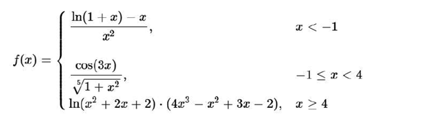
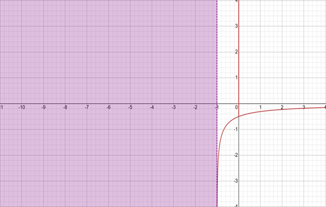
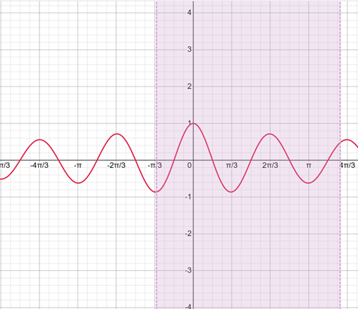
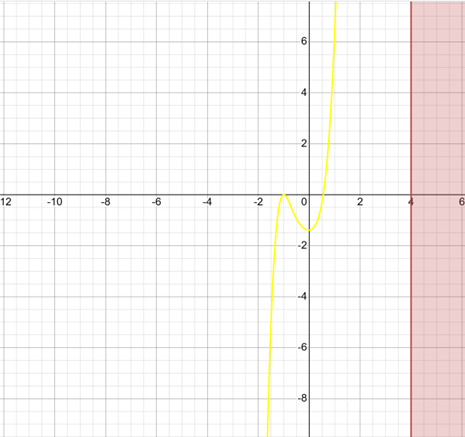

# Курсовая работа
Цель данной работы - алгоритмизация и написание кода на языке СИ для табулирования кусочной функции f(x), 
использующую многоальтернативный выбор решения:

### График функции f(x) при x < -1

### График функции f(x) при -1 <= x < 4

### График функции f(x) при x >= 4

## Задачи, которые необходимо решить в данной работе:
Создать интерфейс программы, который должен обеспечивать выполнение операций:
 - Значение – f(x) в точке;
 - Таблица – x → f(x) на интервале;
 - Min/max - экстремумы на отрезке;
 - Поиск x – найти x: f(x) ≈ Y;
 - Производная - f’(x) в точке;

## 📁 Структура проекта

├── .gitattributes

├── .gitignore

├── main_file.c

├── func.h

├── func.c

├── Kursovaya_Rabota_1.sln

├── Kursovaya_Rabota_1.vcxproj

├── Kursovaya_Rabota_1.vcxproj.filters

├── funci.png

├── grafic1.png

├── grafic2.png

├── grafic3.png

└── README.md

## 🔧 Реализованные функции и структуры

### 1. `Функция double f(double x) `
- **Назначение**: Вычисление значения заданной кусочной функции.
- **Параметры**:
  - x — аргумент функции
- **Возвращает**: вычисленное значение функции f(x)

### 2. `double solve(double y, double a, double b, double eps) `
- **Назначение**: Нахождение значения аргумента x по заданному значению функции y методом бисекции
- **Параметры**:
  - y — заданное значение функции
  - a — левая граница интервала
  - b — правая граница интервала
  - eps — требуемая точность вычислений
- **Возвращает**: приближённое значение аргумента x

### 3. `double der2(double x)`
- **Назначение**: Численное вычисление производной функции в точке
- **Параметры**:
  - x — точка, в которой вычисляется вторая производная
- **Возвращает**: значение второй производной функции fʺ(x)
 

### 4. `void table(double a, double b, double step)`
- **Назначение**: Формирование и вывод таблицы значений функции на заданном интервале.
- **Параметры**:
  - a — начало интервала
 - b — конец интервала
 - step — шаг изменения аргумента

- **Возвращает**: ничего (void)

### 5. `void minmax(double a, double b, double step, double minx, double minv, double* maxx, double* maxv)**`
- **Назначение**: Нахождение минимума и максимума функции на заданном отрезке.
- **Параметры**:
  - a — начало интервала
  - b — конец интервала
  - step — шаг перебора значений
  - minx — указатель на аргумент минимума
  - minv — указатель на значение минимума
  - maxx — указатель на аргумент максимума
  - maxv — указатель на значение максимума

- **Возвращает**: ничего (результаты передаются через указатели)
